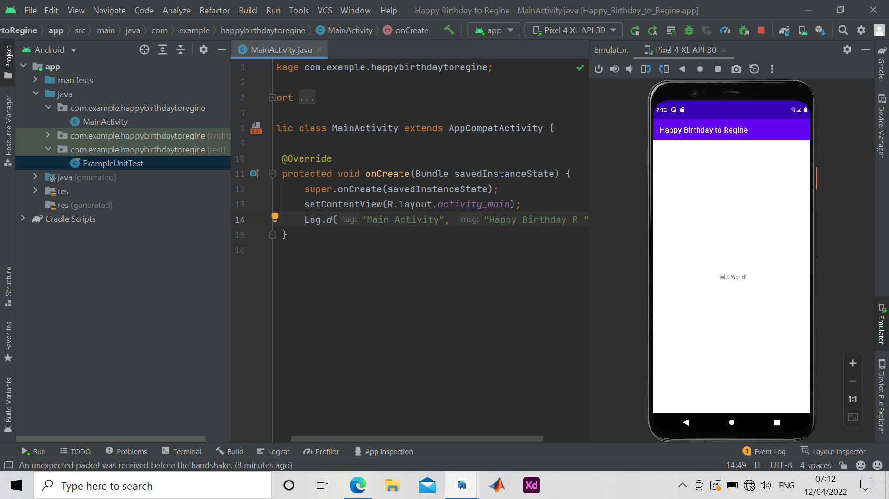

## Question
Challenge: Now that you are set up and familiar with the basic development workflow, do the
following:
1. Create a new project in Android Studio.
2. Change the "Hello World" greeting to "Happy Birthday to " and the name of someone with a
recent birthday.
3. (Optional) Take a screenshot of your finished app and email it to someone whose birthday
you forgot.
4. A common use of the Log class is to log Java exceptions when they occur in your program.
There are some useful methods, such as Log.e(), that you can use for this purpose. Explore methods you can use to include an exception with a Log message. Then, write code in your
app to trigger and log an exception.

## Solution
This Challange was done on the 12th of April and it was dedicated to Regine since it was her birthday and it was sent to her Via whatsapp

## Screenshot of Challenge

